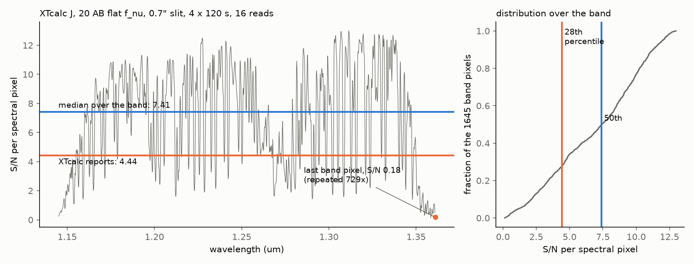
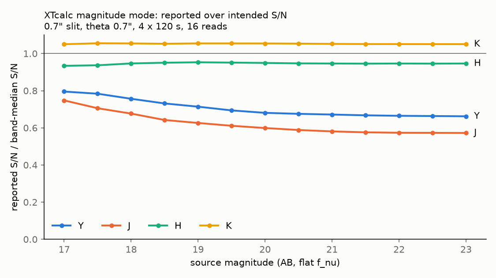

# XTcalc (MOSFIRE ETC): an indexing bug in the magnitude-mode S/N

*keck-etcs project, 2026-10-05. Reproducible with
`scripts/mosfire/xtcalc_bug_report.py` and `scripts/mosfire/compare_xtcalc.py`.*

## Summary

- In magnitude mode, XTcalc reports a "median S/N per spectral pixel" over
  the band. That median is computed with an index array built for one array
  but applied to a shorter one.
- IDL clips the out-of-range subscripts to the last element instead of
  raising an error. The reported value is therefore not the band median: it
  is taken over a shifted set of pixels, padded with copies of the band's
  last (red-edge) pixel.
- **Confirmed with the real program:**
  - Test case: J band, 0.7" slit, angular extent 0.7", 4 exposures, 16
    Fowler reads, J = 20.0 AB flat f_nu, 480 s total, default airmass and
    water vapour.
  - The XTcalc GUI run at WMKO reported **S/N = 4.4**.
  - The median over the band's pixels is **7.41**, so the reported value is
    0.60 of it, about the 28th percentile of the band's S/N.
- **Size of the effect,** for a 0.7" slit, 4 x 120 s and 16 reads, over
  17-23 AB:

  | Band | Reported S/N / band median |
  |---|---|
  | J | 0.57-0.75 |
  | Y | 0.66-0.80 |
  | H | 0.93-0.95 |
  | K | 1.05 |

- **Exposure-time mode uses the same index** and returns times that are too
  long. For S/N 10 per pixel at J = 20 AB it gives 2343 s, against 824 s
  from the band median (2.8x).
- The reported mean throughput uses it too: 0.178 in J, against 0.238 over
  the intended pixels.
- Line-flux mode is not affected.
- The fix is one line (see "Fix").

## Program

- `XTcalc.tar` as distributed on the Keck MOSFIRE ETC page
  (https://www2.keck.hawaii.edu/inst/mosfire/etc.html), sha256
  `344b45b44c5ca76e93fbae20ee421b2707419ab6082aa5a5a213a7ac353ec4ae`.
- GUI title and manual: v2.0 (G. C. Rudie; manual dated 2012-06-29).
- `bin/XTcalc.pro`, sha256
  `71b6099fe39056450a07239e381f3c16d4d23241896ad5c01b86da1d5c675bd0`.
  Line numbers below refer to this file.

## The code

All arrays are first computed on a 3072-pixel grid (`mosfire_resolution`),
then cut to the band, where the LSF-convolved filter exceeds 0.1:

```idl
459:  band_index=where(fltSpecObs gt 0.1)
...
480:  NONzero_index=where((raw_bkSpecObs ge 0) and (raw_bkSpecObs ne -0))   ; on the FULL 3072-pixel grid
...
483:  raw_bkSpecObs=raw_bkSpecObs[band_index]                               ; arrays now band-cut
484:  wave_grid=wave_grid[band_index]
...
487:  filt_index=NONzero_index                                               ; full-grid indices kept
...
580:     sn_index=filt_index                                                 ; magnitude mode
...
709:     time=median(timeSpec[sn_index])                                     ; exposure-time mode
...
789:     stn = median(snSpecObs[sn_index])                                   ; reported S/N
792:     signal = median(sigSpecObs[sn_index])*time[0]
795:     background = median(bkSpecObs[sn_index])*time[0]
801:     noise=median(noiseSpecObs[sn_index])
```

What goes wrong:

1. `NONzero_index` holds positions on the full grid, but `snSpecObs`,
   `sigSpecObs`, `bkSpecObs`, `noiseSpecObs` and `timeSpec` are band-cut.
   Index *k* of the full grid is not pixel *k* of the band. The band starts
   at full-grid index 722 (Y), 734 (J), 404 (H) or 126 (K).
2. In J and Y the sky array, linearly extrapolated by `interpol`, stays
   positive far blueward of the band. So `NONzero_index` is longer than the
   band, and its excess entries point beyond the end of the band arrays.
   IDL clips out-of-range elements of a subscript array to the last element
   (no `compile_opt strictarrsubs` is set in the package). Each excess entry
   therefore reads the band's last pixel, at the red edge where the filter
   is at 10 percent and the S/N is lowest.
3. The changelog in the file header says the intent: "(6) Currently the S/N
   etc are calculated over the portion of sky spectrum that is not
   zero-valued as opposed to being over the full band pass of the filter".
   That is, the median over the band pixels with non-zero sky.

Counts for the test configuration (0.7" slit; the counts do not depend on
the source):

| Band | Band pixels | `filt_index` entries | Entries beyond the band (read the last pixel) |
|---|---|---|---|
| Y | 1592 | 2371 | 779 (33 percent) |
| J | 1650 | 2379 | 729 (31 percent) |
| H | 2119 | 1902 | 242 (13 percent) |
| K | 2460 | 2448 | 0 (the indices are offset by 126 pixels, but none overflows) |

## Confirmation

- A Python port of XTcalc (`scripts/mosfire/compare_xtcalc.py`) reproduces
  the IDL program from its own data files: the filter, the efficiency
  curve x mirror reflectance squared, the 2012 MOSFIRE sky, and the Gemini
  transmission at airmass 1 and 1.6 mm. It also reproduces `interpol`'s
  linear extrapolation, the velocity-space convolution and the subscript
  clipping.
- Checks against the real program:

  | Case | XTcalc | Port |
  |---|---|---|
  | Magnitude mode, the J test case above (XTcalc GUI at WMKO, 2026-10-05) | **4.4** | **4.437** with the bug, 7.407 without |
  | Line mode, the manual's Figure 1 (K, 0.7"/0.7", 1 x 1000 s, 16 reads, 9e-18 erg/s/cm^2 at 6563 A, z = 2.3, 30 km/s) | 9.1 | 8.85 |

  In the line case, dark (58.92 e-) and read noise (12.87 e-) agree
  exactly. The manual's GUI is the earlier v1.8 beta.
- The GUI's 4.4 matches the port with the bug and rules out the band median
  (7.41). The numbers for Y, H and K below come from the port; only J has
  been checked against the GUI.

## Size of the effect

**Figure 1.** J = 20 AB flat f_nu, 0.7" slit, 4 x 120 s, 16 reads.



- Left: XTcalc's per-pixel S/N across the band.
- The blue line is the median over the 1645 band pixels with non-zero sky
  (7.41; 7.39 over all 1650). The orange line is the value XTcalc reports
  (4.44).
- The orange point is the last band pixel (1.3610 um, S/N 0.18), which the
  clipped indices repeat 729 times.
- Right: the cumulative distribution of the band's per-pixel S/N. The
  reported value sits at the 28th percentile.

**Figure 2.** Reported S/N over the band median, against magnitude, for
each band (same configuration).



| Band | AB 17 | AB 19 | AB 21 | AB 23 | Exposure time for S/N 10 at AB 20, reported / band median |
|---|---|---|---|---|---|
| Y | 0.795 | 0.714 | 0.672 | 0.662 | 1.97 |
| J | 0.748 | 0.626 | 0.581 | 0.572 | 2.84 |
| H | 0.934 | 0.953 | 0.946 | 0.946 | 1.11 |
| K | 1.050 | 1.055 | 1.052 | 1.051 | 0.90 |

- The bias is largest for faint sources, where the low-S/N red-edge pixel
  dominates the padding.
- In K no index overflows, but the offset selects a shifted set of pixels,
  and the reported S/N is 5 percent high.
- The S/N ratio is per spectral pixel. The exposure-time ratio follows from
  the same indexing applied to the per-pixel times (line 709).
- The other magnitude-mode outputs (signal, background and noise per
  spectral pixel, lines 792-801) are medians over the same index and carry
  the same selection.
- **The reported "Throughput"** (line 754, `mean(tpSpecObs[sn_index])`)
  uses the same index. With the bug it reads 0.178 in J against a mean of
  0.238 over the intended pixels (Y 0.171 against 0.205, H 0.326 against
  0.332, K 0.300 against 0.306).
- **"Max e- per pixel"** (line 757, XTcalc's linearity warning) also takes
  its maximum over `sn_index`. In the configurations above it equals the
  maximum over the whole band, because the brightest pixel (an OH line) is
  selected either way: J 10631, Y 3555, H 51632, K 33426 e- per pixel per
  exposure at 20 AB. A configuration whose brightest pixel falls in the
  unselected part of the band would under-report it; that case was not
  searched for.

## Not affected

- **Line-flux mode.** It uses `line_index`, computed on the band-cut
  wavelength grid (line 497).
- **The per-pixel values in the plots.** The plotting routines (lines
  1149-1256) index wavelength and value with the same `filt_index`, so each
  plotted point pairs the right wavelength and value. The plotted range is
  the selected subset, though: in H the curves start 459 band pixels late,
  and in J and Y the excess entries all land on the last pixel. The spectra
  written to file are the full band-cut arrays.

## Fix

Build the index on the band-cut sky. For example, replace line 487 with:

```idl
  filt_index=where(raw_bkSpecObs gt 0)      ; after line 483: band-cut, non-zero sky
```

(`raw_bkSpecObs` has already been cut to the band and clipped at 0 by
then.) Alternatively, compute `NONzero_index` after line 483. With this
change the port returns the band median: 7.41 for the J test case.

## Caveats

- Only the J magnitude-mode result has been confirmed against the IDL
  program, to the GUI's one-decimal precision. The Y, H and K values come
  from the port, which matches the program in the two cases above.
- The ratios depend on the configuration (slit, angular extent, exposures,
  reads) through the shape of the per-pixel S/N across the band. The table
  is for one configuration.
- An unrelated detail noticed during the port: in H, XTcalc's linearly
  extrapolated efficiency curve is negative over 1.4542-1.4604 um (37
  band pixels). These pixels have zero sky, so they lie outside both the
  reported and the intended median and do not affect the numbers above.

## Reproduce

```
conda run -n pypeit14b python scripts/mosfire/xtcalc_bug_report.py     # tables above, figures
conda run -n pypeit14b python scripts/mosfire/compare_xtcalc.py        # port, manual check
```

Both read the XTcalc files from `$KECK_ETCS_DATA/external/xtcalc/XTcalc_dir`
(the unpacked `XTcalc.tar`). How to run the IDL program itself:
`docs/XTcalc_HOWTO.md`.
