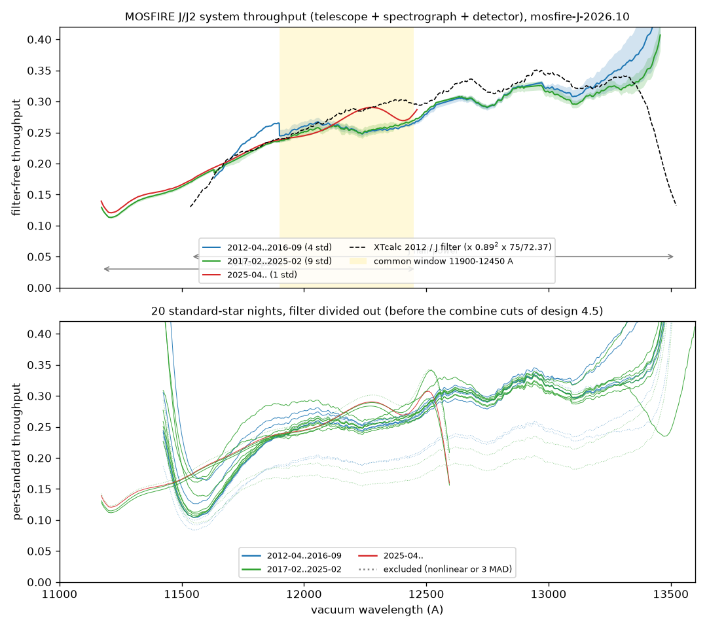
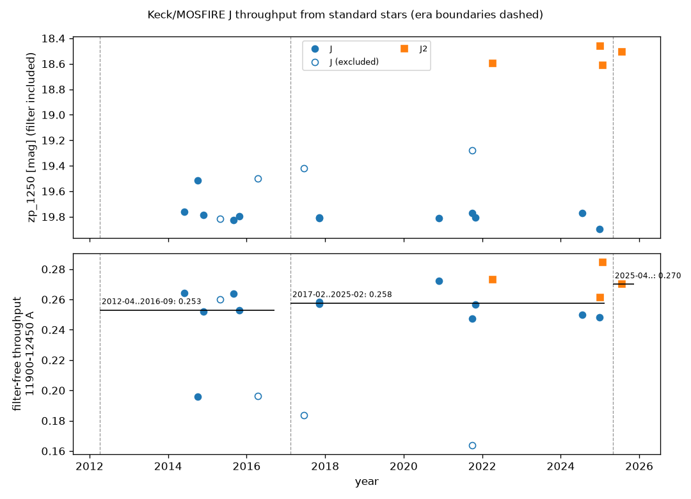
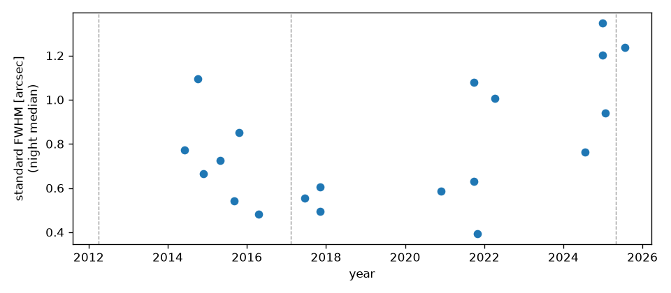
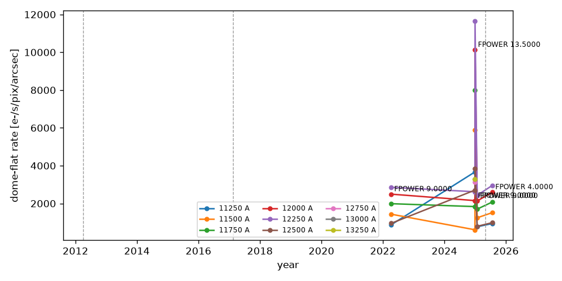
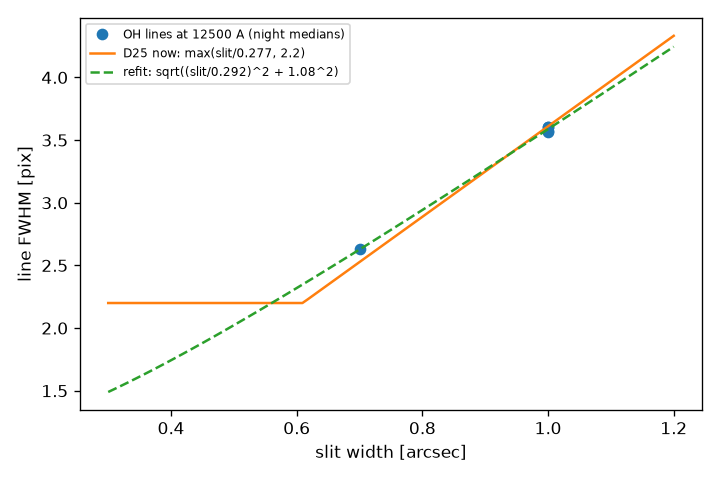
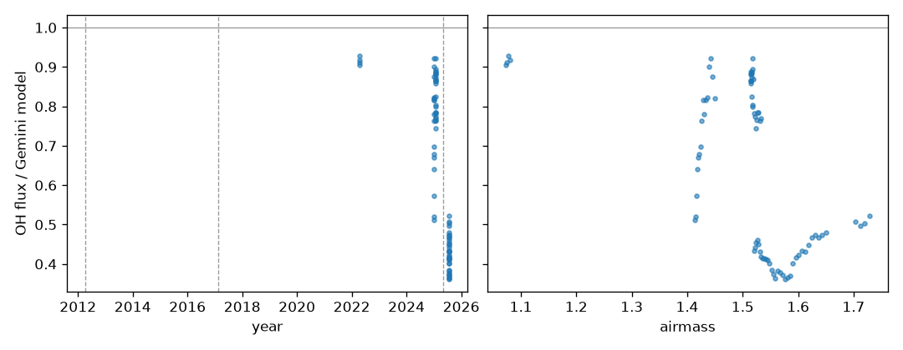
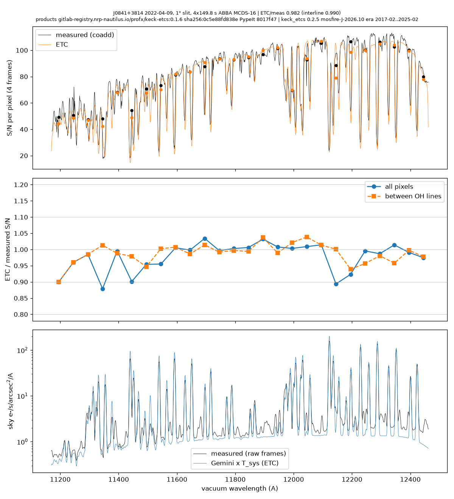
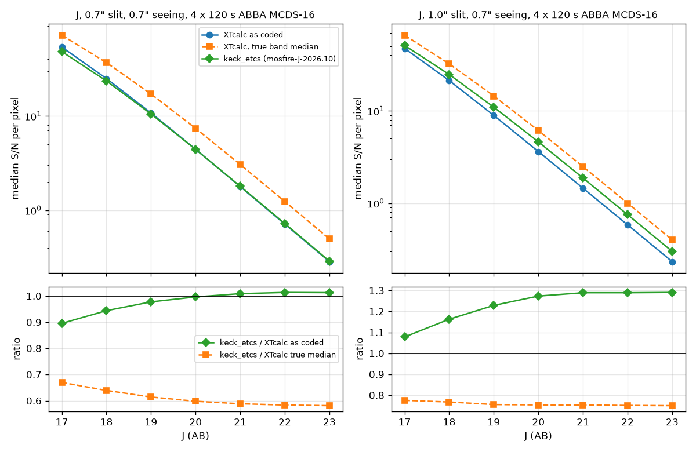
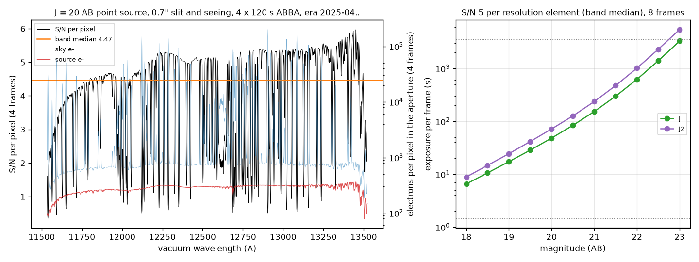

# Keck/MOSFIRE J-band throughput and exposure-time calculator: report

*2026-10-09. J. Xavier Prochaska and Claude (Opus 5.5).*

*Versions: keck_etcs 0.2.5; calibration release `mosfire-J-2026.10`;
reductions on Nautilus images 0.1.6-0.2.5 (PypeIt `etc-fixes` pins
`8017f47`-`bc18a3b`).*

*Companions:*

- the design and its decisions: `docs/keck_mosfire_design.md`;
- the release record: `CHANGES.md`;
- the WMKO interface: `docs/wmko_api_note.md`;
- the operator guide: `nautilus/README.md`.

*Figures in `reports/figures/` are made by
`scripts/mosfire/make_report_figures.py`, those in `docs/figures/` by
`plot_throughput_trend.py` and `plot_monitor_trends.py`. The tables come from
`scripts/mosfire/report_tables.py`.*

## Summary

- **Throughput.** We measured MOSFIRE's end-to-end J-band throughput
  (telescope + spectrograph + detector, filter divided out) from 20
  standard-star nights in 2014-2025, all reduced by us with PypeIt.
  - 14 nights enter the first calibration release, across all three
    instrument eras.
  - The median filter-free throughput over 11900-12450 A is **0.258, 0.257
    and 0.270** in the eras 2012-04..2016-09, 2017-02..2025-02 and
    2025-04.. respectively.
  - There is no change from era to era beyond the 2-3 percent scatter
    between standards, and no measurable decline within an era
    (-0.3 +- 0.5 percent per year in 2017-2025).
- **Validation.** On J0841+3814 (2022-04-09, 4 x 150 s ABBA), the ETC
  reproduces PypeIt's measured S/N to **0.982** over the band and **0.990**
  between OH lines. The criteria are 20 and 10 percent.
- **XTcalc.** Keck's existing ETC under-reports its own band-median S/N in
  magnitude mode by about 40 percent, through an indexing quirk. That quirk
  happens to offset three effects XTcalc omits: slit loss, the measured read
  noise, and a realistic extraction aperture. The two calculators therefore
  agree to within 0.89-1.29 for J continuum sources. Against XTcalc's true
  median, keck_etcs predicts 0.58-0.78 of its S/N. The throughput itself
  agrees with XTcalc's 2012 curve to 3 percent.
- **Detector.** The MOSFIRE CDS read noise measured on our own flats is
  21.4 e-, against Keck's table value of 21 e-.
  - PypeIt had hard-coded 5.8 e- (MCDS-16) for every frame.
  - The fix (`ronoise` from `SAMPMODE`/`NUMREADS`) is committed on PypeIt's
    `etc-fixes` branch.
- **Main open systematics:**
  - a J/J2 offset of about 5 percent;
  - the tabulated J filter edges;
  - the A0V depression blueward of 11900 A;
  - the sky continuum between OH lines, which is 1.14-1.34x the Gemini
    model on our one validation night while the lines are 0.4-0.9x.

## 1. Data and method

The method is in the design document (sections 4 and 5).

**Sample.** Standards are taken only from slits >= 3" wide (D4), so slit
loss does not enter the throughput. The KOA census (`scripts/koa/`, 2026-10-05)
showed that the 5" long slit was rare for standards:

- 51 of the 62 public wide-slit standard rows are `long2pos_specphot`, whose
  4" bars carry the sample;
- 9 are `LONGSLIT-46x5`, nearly all from the Hennawi program (2022-2025);
- 2 are 10" slits.

The usable wide-slit sample is 52 rows on 44 nights, over all three eras.

A night is reducible only if it also has a wavelength calibrator:

- OH lines in >= 55 s narrow-slit frames that night;
- or, for `long2pos_specphot`, Ne/Ar arcs on the mask, which only 15 of the
  43 specphot rows have.

This leaves 20 reducible nights and 13 stars. We added LDS749B 2022-04-09
from the PypeIt dev suite.

**Reduction.** Every night was reduced by PypeIt in a Kubernetes pod on
Nautilus, one night per pod, with a pinned image (design 4.8). The fixes
found while reducing went into PypeIt's `etc-fixes` branch:

- the arc extraction centre;
- the long2pos alignment box;
- the 4" bar wavelength transfer;
- the long2pos bar widths;
- file names for target names containing `/`;
- extraction trace refinement off for MOSFIRE;
- the read noise.

Two more were needed for long2pos nights and live in the driver
(`reduce_standard.py`): `split_merged_bars`, for flats with no gap between
bars, and a cap on the number of OH arc frames, which avoids out-of-memory
kills. All 20 nights pass the gates (spec1d present, wavelength RMS, finite
zero point, throughput 0.15-0.45).

**Throughput.** PypeIt's `IR` sensfunc fits the zero point and the telluric
model together. `tell_npca = 3`, because the default 5 is degenerate over
J2 (design 4.3). We convert the zero point to throughput with the 72.37 m^2
effective aperture and divide out the Keck filter curve. White dwarfs are
fluxed with CALSPEC; A0V stars with Vega scaled to their 2MASS J (N3).

**Combine.** Per era, the pixel-wise median of the filter-free curves is
taken, with three cuts (design 4.5):

- J rows are kept only where the J filter is >= 0.9 of its peak;
- A0V rows only redward of 11900 A;
- nights more than 3 MAD from the era median over 11900-12450 A are
  excluded whole.

## 2. The standards

| Date | Star | Class | Filter | Mask | Read | t [s] | Airmass | PWV [mm] | zp_1250 | thru_common | Era | Flag |
|---|---|---|---|---|---|---|---|---|---|---|---|---|
| 2014-06-01 | Feige110 | WD | J | long2pos_specphot 4" | CDS | 21.8 | 1.48 | 10.0* | 19.76 | 0.264 | 2012-04..2016-09 | - |
| 2014-10-05 | 55Dra | A0V | J | long2pos_specphot 4" | CDS | 1.5 | 1.44 | 10.0* | 19.52 | 0.196 | 2012-04..2016-09 | excluded_3mad |
| 2014-11-23 | HD95126 | A0V | J | long2pos_specphot 4" | CDS | 4.4 | 1.16 | 5.5* | 19.79 | 0.252 | 2012-04..2016-09 | - |
| 2015-04-28 | HD159008 | A0V | J | long2pos_specphot 4" | CDS | 2.9 | 1.22 | 4.8 | 19.82 | 0.260 | 2012-04..2016-09 | excluded_nonlinear |
| 2015-09-04 | HD18571 | A0V | J | long2pos_specphot 4" | CDS | 5.8 | 1.08 | 10.0* | 19.83 | 0.264 | 2012-04..2016-09 | - |
| 2015-10-22 | HD54601 | A0V | J | long2pos_specphot 4" | CDS | 4.4 | 1.18 | 7.6* | 19.80 | 0.253 | 2012-04..2016-09 | - |
| 2016-04-17 | HD74721 | A0V | J | long2pos_specphot 4" | CDS | 18.9 | 1.01 | 4.4* | 19.50 | 0.196 | 2012-04..2016-09 | excluded_nonlinear |
| 2017-06-15 | HD133772 | A0V | J | long2pos_specphot 4" | CDS | 8.7 | 1.23 | 10.0* | 19.42 | 0.184 | 2017-02..2025-02 | excluded_nonlinear |
| 2017-11-05 | HD74721 | A0V | J | long2pos_specphot 4" | CDS | 8.7 | 1.01 | 8.0* | 19.81 | 0.258 | 2017-02..2025-02 | - |
| 2017-11-06 | HD74721 | A0V | J | long2pos_specphot 4" | CDS | 5.8 | 1.01 | 8.6* | 19.81 | 0.257 | 2017-02..2025-02 | - |
| 2020-11-26 | HD65158 | A0V | J | long2pos_specphot 4" | CDS | 1.5 | 1.26 | 10.0* | 19.81 | 0.272 | 2017-02..2025-02 | - |
| 2021-09-28 | HD21379 | A0V | J | long2pos_specphot 4" | CDS | 4.4 | 1.21 | 5.1* | 19.28 | 0.164 | 2017-02..2025-02 | excluded_nonlinear |
| 2021-09-30 | HD21379 | A0V | J | long2pos_specphot 4" | CDS | 1.5 | 1.20 | 7.6* | 19.77 | 0.248 | 2017-02..2025-02 | - |
| 2021-10-27 | HD210501 | A0V | J | long2pos_specphot 4" | CDS | 2.9 | 1.07 | 10.0* | 19.81 | 0.257 | 2017-02..2025-02 | - |
| 2022-04-09 | LDS749B | WD | J2 | LONGSLIT-46x5 | MCDS-16 | 119.3 | 1.58 | 1.6 | 18.60 | 0.273 | 2017-02..2025-02 | - |
| 2024-07-21 | Feige110 | WD | J | long2pos_specphot 4" | CDS | 59.6 | 1.22 | 7.2* | 19.77 | 0.250 | 2017-02..2025-02 | - |
| 2024-12-29 | GD153 | WD | J | LONGSLIT-46x5 | MCDS-16 | 88.7 | 1.00 | 1.3 | 19.89 | 0.248 | 2017-02..2025-02 | - |
| 2024-12-30 | GD153 | WD | J2 | LONGSLIT-46x5 | MCDS-16 | 119.3 | 1.01 | 1.7 | 18.46 | 0.261 | 2017-02..2025-02 | - |
| 2025-01-25 | GD153 | WD | J2 | LONGSLIT-46x5 | MCDS-16 | 88.7 | 1.06 | 3.3 | 18.61 | 0.285 | 2017-02..2025-02 | excluded_3mad |
| 2025-07-23 | GD153 | WD | J2 | LONGSLIT-46x5 | MCDS-16 | 119.3 | 1.25 | 4.8 | 18.50 | 0.270 | 2025-04.. | - |

How to read the table:

- **`thru_common`** is the median filter-free throughput over 11900-12450 A,
  inside both filters.
- **`zp_1250`** includes the filter, so it is comparable only within one
  filter.
- **PWV:** a `*` marks a telluric fit outside the Gemini grid
  (`pwv_extrapolated`). PWV is a nuisance parameter here and does not enter
  the throughput.
- **Exclusions:**
  - four A0V nights exceed the 26k ADU non-linearity limit (99.9th
    percentile of the raw standard frames) and are excluded at harvest;
  - two nights are excluded by the 3-MAD test.

## 3. Throughput

*Figure 1.* Top: the release's filter-free era curves (pixel-wise median,
shaded by the MAD). Also shown: XTcalc's 2012 efficiency on our aperture,
with the J filter divided out, and the J and J2 half-power bands. Bottom:
every standard's harvested curve before the combine cuts. Dotted curves are
excluded nights.

*Figure 2.* `zp_1250` (top, per filter) and `thru_common` (bottom) against
date, with era medians. Open symbols are excluded nights.

| Era | n | thru_common median | MAD | slope [%/yr] | Curve range [A] |
|---|---|---|---|---|---|
| 2012-04..2016-09 | 4 | 0.258 | 2.2 % | -1.0 +- 2.7 (1.4 yr) | 11633-13457 |
| 2017-02..2025-02 | 9 | 0.257 | 2.7 % | -0.3 +- 0.5 | 11172-13457 |
| 2025-04.. | 1 | 0.270 | - | - | 11171-12462 |

**Findings.**

- **No era-to-era change** beyond the 3-4 percent per-standard scatter
  expected from the uncertainty budget (design 4.7). In particular, the
  2017 collimator repair and the 2025 CSU repair left no detectable step.
  The 2025-04.. era has one J2 standard, which sits 5 percent above the
  2017-2025 median; that is the size of the J/J2 offset below.
- **No trend within an era.** Residual correlations of `thru_common` (era
  medians removed) are 1.8 sigma with airmass, 0.2 sigma with PWV and
  0.6 sigma with slit width. `zp_1250` against airmass in J is 1.9 sigma.
  The telluric division is therefore adequate.
- **The A0V model works.** Unsaturated A0V nights give `zp_1250`
  19.77-19.83 in J, against 19.76-19.90 for the white dwarfs. The dense A0V
  series can therefore carry the trend between white-dwarf nights.
- **Non-linearity is the main hazard of short A0V frames.** Four of the 13
  A0V nights exceed 26k ADU and are excluded. Three of them read 24-36
  percent low on `thru_common` (HD74721 2016, HD133772, HD21379
  2021-09-28); HD159008 does not. The harvest now flags them automatically.
- **The ETC completes partial eras.** An era whose standards do not cover a
  band is completed from the nearest era that does, scaled over
  11900-12450 A, with a warning. In the release, 2025-04.. over J
  (12462-13457 A) takes 2017-2025 x 1.024, and 2012-2016 over J2
  (11172-11633 A) takes 2017-2025 x 1.005.

**Systematics found** (the release cuts handle the first two):

1. **The tabulated J cut-on is too high.** The same white dwarf (GD153,
   2024-12-29/30) through J falls below its J2 curve by 10 percent at
   11650 A, 3 percent at 11800 A and 0 at 12000 A. The red end behaves the
   same way: every J curve rises past about 13300 A, where the filter is
   divided out on its cut-off (Figure 1). J rows are used only where
   T_J >= 0.9 of its peak.
2. **A0V curves are depressed blueward of about 11900 A.** They reach
   0.10-0.13 at 11600 A, against 0.14-0.19 for the white dwarfs, while the
   classes agree at 12000 A. The cause is not established. A0V rows are
   used only redward of 11900 A. As a consequence,
   the 2012-2016 curve steps at 11900 A, because blueward of it only
   Feige110 contributes.
3. **J/J2 offset.** In 11900-12450 A, inside both filters, J2 nights sit
   about 5 percent above J nights. The measured J2/J ratio and the filter
   curves agree only to 3-9 percent. This sets the systematic floor of a
   mixed-filter era median.
4. **55 Dra 2014-10-05** reads 0.196, 24 percent low. It is not saturated
   by our criterion, so the cause is unexplained; it is excluded by 3 MAD.
   Its frames are 1.45 s, the minimum integration, on a J = 6.2 star.

**Against XTcalc.** The 2012-2016 curve times the J filter is **2.9 percent
below** XTcalc's 2012 efficiency, after scaling XTcalc to our 72.37 m^2
aperture (75 / 72.37) and with its mirror reflectance (0.89^2). The 250 A
bins range from -13 to +13 percent (`verify_release.py`, check 2). The whole
chain agrees at the 10 percent level.

*Correction:* the release log first quoted +3.6 percent. That number
compared our filter-free curve with XTcalc's efficiency, which includes the
order-sorting filter.

## 4. Calibration monitor

`keck_etcs/data/mosfire/monitor/calib_monitor.ecsv` has 2456 rows on all 20
nights: spatial FWHM, dome-flat rate, OH line widths and OH fluxes (design
4.9). At the release, 169 rows on 19 metric/era sets carry `trend_3mad`.
These are flags, not exclusions.

*Figure 3.* Night-median FWHM of the standards: 0.4-1.35". On the 5" slit,
9 of the 10 standard frames lose less than 1 percent to the slit (D26
Moffat; monitor metric `slitloss_gt1pct`), which supports D4. The
`long2pos_specphot` 4" frames are not covered by that metric.

*Figure 4.* Dome-flat rate per arcsec of slit at fixed wavelengths, for the
LONGSLIT nights with dome flats. The lamp power `FPOWER`
changes between nights (4.0, 9.0, 13.5), so the rate is comparable only at
one power. At 12000/12500 A against `zp_1250` the correlation over 4 J2
nights is r = -0.78 (1.2 sigma), which is not meaningful across lamp powers.
The flats cannot yet separate lamp ageing from optics.

*Figure 5.* OH line FWHM at 12500 A against slit width:

- 1" gives 3.56-3.61 px on 4 nights;
- 0.7" gives 2.63 px.

The interim rule `max(w/0.277, 2.2)` was 3.8 percent narrow at 0.7". The
release adopts `sqrt((w/0.292)^2 + 1.08^2)` px (D25), which fits both widths.
Only two widths are measured.

*Figure 6.* OH line flux over the Gemini model, per science frame, against
date and airmass.

- Per-night medians are 0.91, 0.77, 0.86 and 0.43 (median 0.82). Within one
  night the ratio drifts by 2x as the OH emission evolves.
- The Gemini model therefore over-predicts the OH lines by about 20
  percent on typical nights.
- The continuum between the lines is not monitored, and on 2022-04-09 it is
  *above* the model (section 5).
- The ETC default `sky_scale` stays 1.0.

## 5. Validation on J0841+3814 (2022-04-09)

*Figure 7.* Top: S/N per pixel of the 4-frame coadd, measured (PypeIt) and
predicted (ETC). Middle: the ratio in 50 A bins, for all pixels and between
OH lines. Bottom: the sky measured from the raw frames against Gemini x
T_sys.

**Setup.**

- **Target:** the bright blind-offset star J0841+3814_OFF (J2 = 15.9 AB),
  not the quasar.
- **Observations:** 1" slit, 4 x 149.8 s ABBA, MCDS-16, airmass 1.076, J2.
- **Reduction:** in a pod, with image 0.1.6.
- **Fluxing:** the coadd is fluxed with the LDS749B sensfunc.
- **ETC input:** the fluxed coadd, divided by the ETC's own LSF-convolved
  atmospheric transmission and slit fraction, then smoothed. The signal side
  is therefore nearly a closure, and the test is the noise model.
- **Script:** `scripts/mosfire/validate_j0841.py`.

| Quantity | S11 (2026-10-05; throughput = LDS749B alone) | Release (2026-10-09) |
|---|---|---|
| Median S/N per pixel, 1.117-1.260 um | measured 81.9; ETC 82.0 | measured 81.9; ETC 80.0 |
| ETC / measured S/N, band (criterion 20 %) | 0.996 | **0.982** |
| ETC / measured S/N, between OH lines (criterion 10 %) | 1.003 | **0.990** |
| ETC / measured S/N, per frame | 0.94, 0.95, 1.04, 1.06 | 0.92, 0.94, 1.03, 1.04 |
| Signal, ETC / measured | 0.999 | 0.980 |
| Sky, measured / Gemini x T_sys, OH lines | 0.86 | 0.89 |
| Sky, measured / Gemini x T_sys, between lines | 1.33 (1.14-1.19 in the cleanest bins) | 1.34 |
| OH centroids, measured - Gemini | -0.07 A (MAD 0.10) | -0.07 A (MAD 0.09, 27 lines) |
| `aperture.length_fwhm` for ratio 1 (default 1.5) | 2.22 | 1.88 |

**Reading.**

- **The ETC reproduces the measured S/N** to 2 percent in the median.
  Between OH lines every 50 A bin is within 0.94-1.04, except the
  telluric-dominated blue edge (0.90). Including the lines, three bins fall
  to 0.88-0.90.
- **The release curve is 2 percent below this night's own standard.** That
  is within the per-standard scatter and the J/J2 offset, and it explains
  the move from 0.996 to 0.982.
- **What this night does and does not constrain.** The star is bright:
  between OH lines the source is 70 percent of the variance, the sky 16 and
  the read noise 13. This night therefore confirms the signal chain and the
  noise bookkeeping (ABBA doubling, read noise, optimal extraction against
  a 1.5-FWHM aperture). It constrains the sky level and the aperture only
  weakly: `length_fwhm` between 1.48 and 2.44 is within 1 percent.
- **The sky continuum is 14-34 percent above the Gemini model** between
  the lines. Next to bright lines it reaches 2.3x, from OH wings beyond the
  Gaussian LSF. Applying x1.33 would change this case by 2.6 percent, but
  faint (J2 = 20-22 AB) sources by about 8 percent.
- **The Gemini grid is consistent with vacuum wavelengths** to 0.1 A
  (0.05 px), which confirms N5.

## 6. Comparison with XTcalc

`scripts/mosfire/compare_xtcalc.py` ports XTcalc v2.0 (Keck's `XTcalc.tar`)
line by line and runs it on XTcalc's own files. See also `docs/XTcalc_bug.md`.

**Check against the manual.** The line-flux example of `MOSFIRE_XTcalc.pdf`
gives S/N 8.85 in the port against 9.1 in the manual. Dark and read noise
agree exactly.

**The XTcalc quirk.** In magnitude mode XTcalc reports the median S/N over
an index array computed on its full 3072-pixel grid but applied to the
band-cut arrays.

- IDL clips the out-of-range subscripts, so 31 percent of the indices repeat
  the band's red-edge pixel.
- The reported "median" is about the 28th percentile: 0.57-0.75 of the true
  median.
- **Confirmed at WMKO** (2026-10-05): the XTcalc GUI gives S/N 4.4 for
  J = 20 AB, 0.7"/0.7", 4 x 120 s, 16 reads. The port gives 4.437 with the
  quirk and 7.392 without.

*Figure 8.* Median S/N per pixel against J (AB): XTcalc as coded, XTcalc's
true band median, and keck_etcs (release). Flat f_nu, 4 x 120 s MCDS-16
ABBA, 0.7" seeing. keck_etcs uses airmass 1.2, PWV 1.6 mm, the
2017-02..2025-02 curve and the default aperture.

| J (AB) | 0.7": XTcalc | true median | keck_etcs | ratio | 1.0": XTcalc | true median | keck_etcs | ratio |
|---|---|---|---|---|---|---|---|---|
| 17 | 53.79 | 71.92 | 48.17 | 0.895 | 47.53 | 66.11 | 51.25 | 1.078 |
| 18 | 24.95 | 36.83 | 23.55 | 0.944 | 21.33 | 32.32 | 24.80 | 1.163 |
| 19 | 10.76 | 17.12 | 10.51 | 0.977 | 8.93 | 14.53 | 10.97 | 1.229 |
| 20 | 4.437 | 7.392 | 4.420 | 0.996 | 3.621 | 6.119 | 4.610 | 1.273 |
| 21 | 1.784 | 3.060 | 1.800 | 1.009 | 1.453 | 2.488 | 1.874 | 1.289 |
| 22 | 0.714 | 1.240 | 0.724 | 1.014 | 0.583 | 1.000 | 0.751 | 1.289 |
| 23 | 0.285 | 0.497 | 0.289 | 1.013 | 0.232 | 0.400 | 0.300 | 1.291 |

**Attribution** (0.7" slit; the factor is each step's S/N over the step
before; J = 17 / 20 / 23):

| Step | Change | Factor |
|---|---|---|
| 1 | XTcalc band-median quirk removed | 1.34 / 1.67 / 1.74 |
| 2 | Area 75 -> 72.37 m^2, AB zero point 48.59 -> 48.6 | 0.976 / 0.971 / 0.970 |
| 3 | Throughput: XTcalc 2012 -> our 2017-2025 curve x J filter | 1.015 / 1.042 / 1.037 |
| 4-5 | Atmosphere: same Gemini source; airmass 1.0 -> 1.2 | 1.000; 0.995 / 0.996 / 0.994 |
| 6 | Sky: MOSFIRE 2012 measured -> Gemini model (interline 2.7x fainter) | 1.090 / 1.353 / 1.449 |
| 7 | Read noise 15/sqrt(16) = 3.75 -> 5.8 e- (Keck table); dark 0.005 -> 0.008 | 0.969 / 0.869 / 0.842 |
| 8 | Extraction pixels theta/0.18" = 3.89 -> ceil(1.5 FWHM / 0.1798") = 6 | 0.938 / 0.832 / 0.807 |
| 9 | Slit x aperture loss: none -> Moffat 0.561 | 0.668 / 0.576 / 0.562 |
| 10 | Sampling and LSF: XTcalc's 1.31 A and R 3310 -> 1.2922 A and our LSF | 1.028 / 1.051 / 1.051 |
| 11 | `compute` against the step-10 engine | 1.000 |

**Reading.**

- **The agreement within 0.89-1.29 is largely an accident.** XTcalc's quirk
  (x0.6) offsets three effects it omits or underestimates: slit loss
  (x0.56-0.76), the measured read noise (x0.84-0.97) and a realistic
  aperture (x0.81-0.94).
- **Against XTcalc's true median,** keck_etcs gives 0.58-0.78.
- **The largest input difference is the sky.** XTcalc's 2012
  MOSFIRE-measured sky has an interline continuum 2.7x the Gemini model's.
  We measure 1.14-1.34x between the lines (section 5). At faint magnitudes
  the choice of `sky_scale` moves the S/N by tens of percent.
- **Small factors:** throughput, atmosphere and area each contribute
  3-4 percent or less.
- **The chain closes** on `compute` to 0.1 percent.

## 7. What the ETC predicts

*Figure 9.* Left: `compute` for a J = 20 AB point source with the defaults
(0.7" slit and seeing, 4 x 120 s ABBA MCDS-16, airmass 1.2, PWV 1.6 mm,
latest era). S/N per pixel, and the source and sky electrons per pixel.
Right: the exposure per frame for S/N 5 per resolution element in 8 frames.

| Era (J = 20 AB, defaults) | J: S/N per pixel | J: per resel | J2: S/N per pixel | J2: per resel |
|---|---|---|---|---|
| 2012-04..2016-09 | 4.63 | 7.51 | 3.19 | 5.17 |
| 2017-02..2025-02 | 4.42 | 7.17 | 3.17 | 5.15 |
| 2025-04.. | 4.47 | 7.25 | 3.26 | 5.29 |

Between OH lines the S/N is about 5 per pixel. Within the lines it drops
below 1, so a source's S/N depends strongly on where its features fall.
Era-to-era differences in the predictions are at most 5 percent.

## 8. Detector: read noise

**Measurement.** `scripts/mosfire/measure_read_noise.py` differences
consecutive CDS lamp-off dome flats of 2022-04-09 (m220409_0022-0026,
`SAMPMODE = 2`, `NUMREADS = 1`). It uses 64 x 64 tiles with <= 10 ADU of
signal, with the photon noise removed and gain 2.15. The result is
**21.4 e-** (16-84 percent of tiles 20.3-22.8), against the Keck table's
21 e-. The laboratory 17.2 e- (Kulas et al. 2012) is not what the detector
delivers on the sky.

**Usage.**

- The KOA `SAMPMODE` census of 168,038 public on-sky spectroscopy frames:
  MCDS 84.2 percent (MCDS-16 73.3), CDS 14.8, UTR 0.94, Single 0.06. UTR
  does not need support (D13).
- 15 of our 20 standard rows are CDS, including every long2pos night.
- Every PypeIt dev-suite MOSFIRE setup holds CDS frames.

**Fix.** PypeIt hard-coded 5.8 e- (the MCDS-16 value) for every frame, so
CDS frames had their read noise underestimated by 3.6x.

- The fix reads `SAMPMODE`/`NUMREADS` and interpolates the Keck table in
  log2 N. It is on PypeIt `etc-fixes` as `38bb1b7`, with a unit test.
- It is not yet in the reduction image, so the release was reduced with
  5.8 e-.
- Only the optimal-extraction weights of the bright CDS standards change,
  so the effect on the throughput is expected well below 1 percent. This
  is not measured.

The ETC itself always used the Keck table: CDS 21 e-, MCDS-N interpolated.

## 9. Limitations and open items

- **Sky continuum.** The Gemini model under-predicts the continuum between
  OH lines (1.14-1.34x on 2022-04-09) and over-predicts the lines
  (0.43-0.91x). One `sky_scale` cannot fit both. A sky-limited validation
  night, and possibly separate line and continuum scales (a schema change),
  are needed. This matters most for faint sources.
- **Extraction aperture.** The 1.5 x FWHM default is consistent with the one
  validation night. The night constrains it only to 1.48-2.44, so a
  sky-limited night must fix it.
- **J/J2 offset (5 percent) and the J filter edges.** Better filter curves,
  or more same-star J/J2 pairs, would remove the largest systematic of the
  era medians.
- **Sparse eras.** 2025-04.. rests on one J2 standard; 2012-2016 has one
  white dwarf blueward of 11900 A.
- **LSF.** Only 0.7" and 1" are measured.
- **Read-noise fix.** Not yet in the reduction image (next image, 0.2.6).
- **55 Dra.** The 24 percent low night is unexplained.

## 10. Provenance

- **Release:** `mosfire-J-2026.10`, the per-standard rows and curves under
  `keck_etcs/data/mosfire/throughput/`.
  - Every row carries its reduction image, digest, PypeIt SHA and
    keck-etcs SHA.
  - `CHANGES.md` lists the images behind the release (0.1.6, 0.2.2-0.2.5)
    with digests and pins.
- **Checks:**
  - `scripts/mosfire/verify_release.py`: ALL CHECKS PASS;
  - `scripts/check_docs.py`: ALL CHECKS PASS;
  - `pytest`: 111 tests, plus 3 slow J0841 tests.
- **Backups:** the reduced products of the release are backed up on the
  Google shared drive under `AIOcean:keck-etcs/releases/mosfire-J-2026.10/`
  (801 files, verified).

## 11. Milestone status (design section 7, definition of done)

| Item | Status | Evidence |
|---|---|---|
| 1. Throughput trend table and plot, LDS749B plus >= 10 KOA standards over >= 2 eras | **Met** | 14 standards in the curves (LDS749B plus 13 KOA) over all three eras; section 3, Figures 1-2 |
| 2. `compute()` for J and J2, schemas, tests | **Met** | `keck_etcs/schema/`; 111 unit, schema and regression tests pass |
| 3. J0841+3814 S/N within 20 percent | **Met** | 0.982 over the band, 0.990 between OH lines (section 5) |
| 4. Design document as built; README Python and CLI examples | **Met** | `docs/keck_mosfire_design.md` v0.5; `README.md`, whose examples `scripts/check_docs.py` runs |
| 5. PypeIt `ronoise` branch filed for review | **Met in substance** | Pushed on `etc-fixes` (`38bb1b7`, with a unit test). A PR into `develop` and the pin move (image 0.2.6) remain. |
| 6. One-page API note for WMKO | **Met** | `docs/wmko_api_note.md` (every schema field, checked) |
| 7. Calibration-monitor table for every reduced night, with trends | **Met** | `calib_monitor.ecsv` has rows for all 20 nights, 169 `trend_3mad` flags; section 4, Figures 3-6 |
